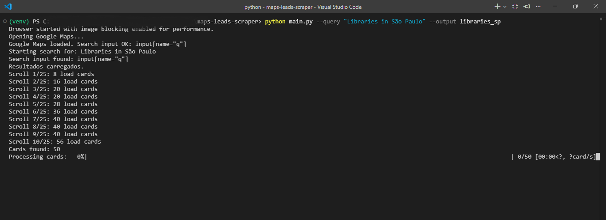
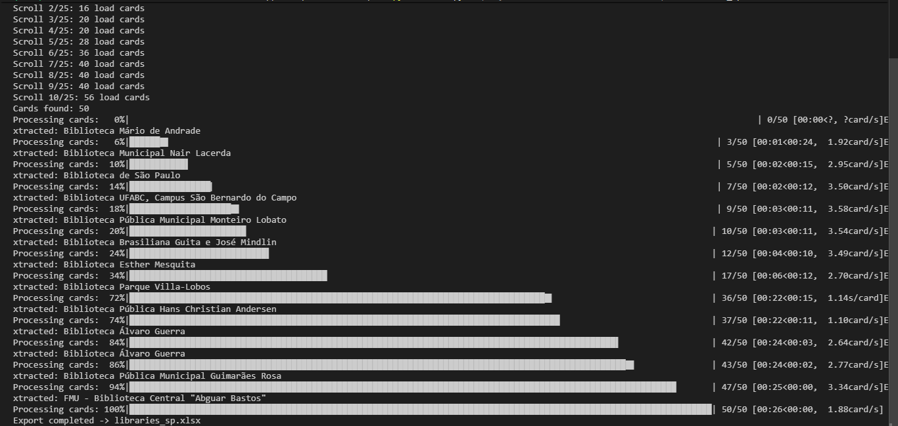
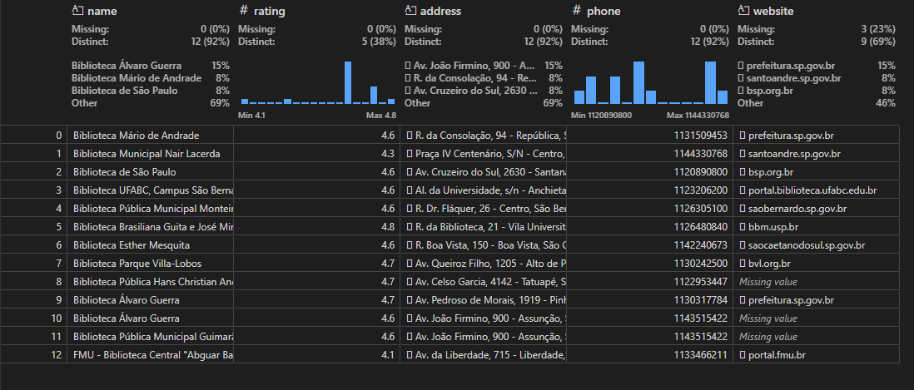

# Maps Leads Scraper

Automated data collection tool built with Playwright for extracting business leads from Google Maps search results.

This project focuses on reliability, structured output, and automation control rather than one-off scraping scripts. It provides a CLI interface, dynamic feed scrolling, and clean data export ready for analysis or lead generation workflows.

---

## Overview

Maps Leads Scraper performs automated searches on Google Maps and collects structured information from listing cards.

It is designed as a reusable pipeline that can be adapted for:

* Lead generation
* Market research
* Data enrichment
* Competitive analysis
* Dataset creation

The scraper handles dynamic content loading and scroll synchronization to ensure consistent extraction.

---

## Features

* Command line interface (argparse)
* Async browser automation using Playwright
* Automated feed scrolling with stability detection
* Structured data extraction
* CSV/Excel export ready
* Image blocking for improved performance
* Modular project structure

### Currently Extracted Fields

* Name
* Rating
* Address
* Phone
* Website

> Reviews and price fields are temporarily disabled while selector stability is being refined.

---

## Example Execution

Run the scraper from the command line:

```bash
python main.py --query "Libraries in São Paulo" --output libraries_sp
```

This will:

1. Launch the browser
2. Perform the search
3. Scroll and collect cards
4. Extract structured data
5. Save results



---

## Automated Scrolling

The scraper synchronizes scrolling with DOM updates to ensure efficient data loading.

It includes:

* Detection of new cards between scrolls
* Stabilization logic to stop redundant scrolling
* Adjustable limits and delays



---

## Output Example

Collected data is cleaned and organized into a structured table.



The exported dataset can be used directly for:

* CRM ingestion
* Marketing outreach
* Business intelligence
* Data pipelines

---

## Installation

### 1 — Clone repository

```bash
git clone https://github.com/yourusername/maps-leads-scraper.git
cd maps-leads-scraper
```

### 2 — Create virtual environment

```bash
python -m venv venv
source venv/bin/activate
```

Windows:

```bash
venv\Scripts\activate
```

### 3 — Install dependencies

```bash
pip install -r requirements.txt
playwright install
```

---

## Usage

Basic query:

```bash
python main.py --query "Coffee shops in Rio de Janeiro"
```

Specify output name:

```bash
python main.py --query "Dentists in Curitiba" --output dentists_curitiba
```

---

## Project Structure

```
maps-leads-scraper/
│
├── main.py
├── scrapper/
│   ├── browser_manager.py
│   ├── data_processor.py
│   ├── export_service.py
│   └── scraper.py 
|__ utils
|   |__ exceptions.py
|
├── docs/images/
├── requirements.txt
└── README.md
```

---

## Technical Highlights

* Async event handling
* DOM synchronization logic
* Mutation-aware scrolling
* Structured normalization pipeline
* CLI parameter handling
* Modular service separation

---

## Limitations

* Google Maps layout changes may require selector updates
* Designed for moderate volume extraction
* Requires manual captcha handling if triggered

---

## Roadmap

* Review extraction reintroduction
* Price extraction support
* Proxy rotation support
* Headless stealth improvements
* Docker container support
* Automated retry/backoff logic
* Dashboard visualization module

---

## Author

Ana Schlink
Computer Science — Software & Data Focus

---

## License

This project is provided for educational and research purposes.
Ensure compliance with the terms of service of target platforms when using scraping tools.
